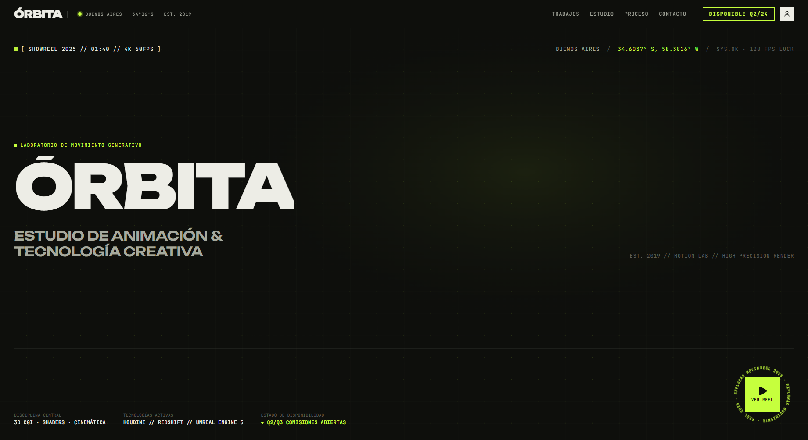

# ÓRBITA

Sitio web multipágina de un estudio de motion design y tecnología creativa con base en Buenos Aires, con estética técnica de terminal y transiciones entre páginas guiadas por GSAP.

**Demo en vivo → [juantrezza.github.io/orbita-studio](https://juantrezza.github.io/orbita-studio/)**



## Qué hace

- **Cuatro páginas con transición propia**: Inicio, Trabajos, Estudio y un caso de estudio por proyecto, más una página 404. Al cambiar de ruta, una cortina lima cubre la pantalla, se monta la página nueva y la cortina se retira hacia arriba. Funciona igual con los links, con el botón atrás del navegador y con navegaciones rápidas encadenadas.
- **Archivo de trabajos** con filtro por disciplina, orden cronológico o alfabético y vista en grilla o lista. Las cards entran escalonadas, y la entrada se repite cada vez que se filtra.
- **Casos de estudio** con player, desafío y solución, métricas, créditos, breakdown visual y navegación al caso anterior y siguiente.
- **Página de estudio** con principios de trabajo, equipo, premios y festivales e infraestructura técnica.
- **Proceso con scroll horizontal**: en desktop la sección queda fija y los cuatro pasos se desplazan de costado mientras se scrollea. Las flechas llevan el scroll al paso anterior o siguiente. En mobile es una lista vertical.
- **Cursor personalizado** en desktop con mouse: un círculo que acompaña a la flecha del sistema, crece sobre links y botones y muestra "VER" sobre las cards de video.
- **Showreel** en un modal con animación generativa en canvas, controles de reproducción y atajos de teclado (espacio y Esc).
- **Marquee de clientes** en dos filas que corren en sentidos opuestos.
- **Formulario de contacto** con validación y sin backend: el envío es simulado.

## Decisiones de diseño y técnicas

- **Lenis + GSAP en un solo loop.** Lenis no usa su propio `requestAnimationFrame`: lo mueve `gsap.ticker`, y cada frame de scroll actualiza ScrollTrigger, así el scroll suave y las animaciones nunca se desfasan. Un `ResizeObserver` refresca los triggers cuando cambia el alto de la página. Las animaciones usan `useGSAP` (se limpian al desmontar) y `gsap.matchMedia`, así en mobile los movimientos son más cortos.
- **Transiciones sobre `HashRouter`.** Las rutas no se renderizan con la URL actual sino con una ubicación "mostrada", que cambia recién cuando la cortina ya tapa la pantalla. Debajo de la cortina:
  - se barren los ScrollTrigger que hayan quedado de la página anterior;
  - Lenis vuelve arriba (o al `#hash`) al instante;
  - se recalculan los triggers de la página nueva.
  
  Si la ruta cambia en medio de una transición, la cortina vuelve a cubrir desde donde estaba y siempre termina en la última ubicación.
- **Reveals que esperan a la cortina.** Los títulos se revelan palabra por palabra con SplitText y máscara. Después de un cambio de página, esos reveals y las entradas de los grids se crean recién cuando la cortina empieza a abrirse, así no se animan tapados. El pin de Proceso y el marquee se crean de inmediato, para que el refresh de la transición ya los tenga en cuenta.
- **Pin horizontal que no rompe el layout.** Las cards de Proceso se agrandan (`max(340px, 40vw)`) solo mientras corre el pin, para que haya recorrido lateral también en pantallas anchas. `pinSpacing` está forzado porque el contenedor de la página es flex, y ahí ScrollTrigger lo desactiva por defecto. Al pasar a mobile o a reduced-motion, `matchMedia` revierte todo y vuelve el layout original.
- **Navegación interna y modales.** Los links internos pasan por `scrollToId`, que usa Lenis con el offset del header fijo. Si en el camino cargan imágenes lazy de más arriba y mueven la sección de destino, al llegar corrige con un tramo corto. Un lock con contador (`lockScroll`, y su hook `useLenisLock`) pausa Lenis mientras hay un modal, el menú mobile o una transición en curso, y `data-lenis-prevent` deja scrollear el contenido interno de los modales.
- **Motion sin re-renders.** El cursor sigue al puntero con `gsap.quickTo` sobre refs, sin `setState` por movimiento. Al scrollear o cambiar de página recalcula qué tiene debajo, así no queda "VER" pegado. El marquee lo mueve GSAP en loop, y su velocidad y dirección siguen a la velocidad del scroll.
- **Reduced-motion.** Con `prefers-reduced-motion`:
  - no se inicializa Lenis;
  - el cambio de página es directo, sin cortina;
  - no hay reveals ni pin: Proceso queda como un track horizontal nativo, con flechas que lo mueven sin animación;
  - no hay cursor custom y el marquee queda quieto.

## Stack

React 19 + TypeScript · Vite · React Router 7 (`HashRouter`) · Tailwind CSS 3 (+ tailwindcss-animate) · GSAP (ScrollTrigger, SplitText) + Lenis · lucide-react · GitHub Actions → GitHub Pages

## Correrlo localmente

```bash
git clone https://github.com/JuanTrezza/orbita-studio.git
cd orbita-studio
npm install
npm run dev   # http://localhost:3000/orbita-studio/
```

## Estructura

```
src/
├── pages/        # Inicio, Trabajos, Estudio, Caso de estudio y 404
├── components/   # navbar, footer, modales, Proceso, marquee, cursor y transición entre páginas
├── hooks/        # scroll suave, lock de Lenis, reveals, marquee y título de página
├── lib/          # motion.ts (Lenis + GSAP + ScrollTrigger) y scroll.ts (navegación interna)
└── data/         # contenido estático: proyectos, equipo, premios, proceso y clientes
```

## Autor

**Juan Moreno Trezza** — [Portfolio](https://juantrezza.github.io/porfolio/) · [LinkedIn](https://www.linkedin.com/in/juanmorenotrezza/) · [GitHub](https://github.com/JuanTrezza)

Proyecto de portfolio: ÓRBITA es un estudio ficticio, y sus clientes, casos, premios y métricas también lo son.
